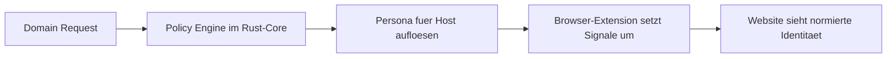

<a id="top"></a>

<div align="center">

# Identity Firewall

**Die policy-driven Privacy-Schicht gegen Profiling und Surveillance Pricing:** Personas statt Zufall, lokale Kontrolle statt Blackbox und ein Setup, das Browser-Signale bewusst normiert, bevor Websites sie auswerten koennen.

[![CI][badge-ci]][ci]
[![CodeQL][badge-codeql]][codeql]
[![License][badge-license]][license]
[![Rust][badge-rust]][core-readme]
[![TypeScript][badge-typescript]][extension-readme]
[![Manifest V3][badge-mv3]][extension-readme]
[![Privacy Research][badge-research]][threat-model]
[![Issues][badge-issues]][issues]
[![PRs][badge-prs]][pulls]
[![Contributors][badge-contributors]][contributors]
[![Last Commit][badge-last-commit]][commits]

Identity Firewall kontrolliert, welche digitale Identitaet Websites zu sehen bekommen: User-Agent, Sprache, Zeitzone, Bildschirmparameter und weitere Signale werden pro Domain ueber Personas auf einen gewuenschten, konsistenten Zustand gebracht.
Das Projekt verbindet einen Rust-Core fuer Policy und Validierung mit einer Browser-Extension fuer JS-seitiges Spoofing und legt den Fokus auf Privacy, Transparenz und Forschung statt auf undurchsichtige Anti-Tracking-Versprechen.

[Schnellstart](#schnellstart) · [Architektur](./docs/ARCHITECTURE.md) · [Threat Model](./docs/THREAT_MODEL.md) · [Core](./core/README.md) · [Extension](./extension/README.md) · [Mitmachen](./CONTRIBUTING.md)

</div>

## Inhaltsverzeichnis

- [Warum Identity Firewall?](#warum-identity-firewall)
- [Das Alleinstellungsmerkmal: Personas statt Zufall](#das-alleinstellungsmerkmal-personas-statt-zufall)
- [Feature Highlights (Today)](#feature-highlights-today)
- [Was heute wirklich implementiert ist](#was-heute-wirklich-implementiert-ist)
- [Architektur auf einen Blick](#architektur-auf-einen-blick)
- [Schnellstart](#schnellstart)
- [Projektstruktur](#projektstruktur)
- [Security und Trust](#security-und-trust)
- [Roadmap (Now / Next / Later)](#roadmap-now--next--later)
- [Mitmachen](#mitmachen)
- [Lizenz](#lizenz)

## Warum Identity Firewall?

Viele Websites lesen nicht nur Inhalte, sondern auch den Kontext, aus dem du kommst: Browser, Sprache, Zeitzone, Bildschirmgroesse und weitere Signale werden zu Profilen verdichtet.
Genau dort setzt Identity Firewall an:

- **Profile werden ueber Personas aktiv normiert**
- **Domain-Regeln steuern, welche Persona wo gilt**
- **Spoofing bleibt bewusst konsistent zwischen Policy und Browser-Oberflaeche**
- **Logging bleibt privacy-aware statt datenhungrig**

Das Ziel ist nicht "unsichtbar werden um jeden Preis", sondern Profilierbarkeit zu reduzieren, Preisunterschiede messbar zu machen und Browser-Identitaet fuer Forschung und Selbstschutz kontrollierbarer zu machen.

[Zurueck nach oben](#top)

## Das Alleinstellungsmerkmal: Personas statt Zufall

Identity Firewall ist kein lose zusammengeklebter Header-Hack.
Der Kern ist ein regelbasiertes Persona-Modell:

- Eine **Persona** beschreibt ein bewusst gewaehltes Identitaetsprofil
- Eine **Rule** mappt Hostnames oder Pattern auf diese Persona
- Die **Policy Engine** loest fuer eine Domain genau die Persona auf, die angewendet werden soll
- Die **Extension** setzt diese Entscheidung in der Browserumgebung um

Dadurch entsteht ein reproduzierbarer Workflow fuer Privacy-Tests, Anti-Profiling-Setups und Research zu Surveillance Pricing.

[Zurueck nach oben](#top)

## Feature Highlights (Today)

- Rust-Core mit Persona-, Rule- und Policy-Modellen
- Config-Loading fuer TOML und JSON inklusive Validierung
- Regelmuster mit Priorisierung nach Spezifitaet
- Privacy-aware Logging mit Persona- und Host-Kontext
- Browser-Extension mit Popup, Background-Logik und Content-Script-Injektion
- JS-seitiges Spoofing fuer `navigator.*`, `screen.*`, `devicePixelRatio` und `matchMedia`
- Dokumentierte Architektur-, Threat-Model- und Runbook-Basis

[Zurueck nach oben](#top)

## Was heute wirklich implementiert ist

Wichtig fuer eine ehrliche Erwartungshaltung:

- **Implementiert**: Rust Policy Engine, Konfigurations-Parsing, Persona-Resolution, Logging-Grundlage und Browser-Extension mit DOM-/JS-Spoofing.
- **Teilweise / in Arbeit**: Header-Rewriting auf Extension-Seite, tiefere Browser-Integrationen und ausgebaute Forschungs-Workflows.
- **Geplant**: HTTP/WASM-Anbindung an den Core, experimentelle Mehr-Persona-Tests und optional eine GUI.

Das Repo ist also schon klar nutzbar und testbar, verkauft aber bewusst noch keine "vollstaendige Anti-Fingerprinting-Magie".

[Zurueck nach oben](#top)

## Architektur auf einen Blick



Die drei Hauptbausteine:

1. `core/` verwaltet Personas, Regeln, Konfiguration und Logging.
2. `extension/` setzt Persona-Entscheidungen im Browser um.
3. `docs/` beschreibt Grenzen, Risiken und Betriebswissen.

Mehr Tiefe dazu gibt es in [docs/ARCHITECTURE.md](./docs/ARCHITECTURE.md) und [PROJECT.md](./PROJECT.md).

[Zurueck nach oben](#top)

## Schnellstart

### Voraussetzungen

- Rust Stable
- Node.js `24`
- ein Chromium-basierter Browser fuer den aktuellen Extension-Workflow

### Root-Checks

```bash
npm install
npm install --prefix extension
npm run verify
pwsh -NoLogo -ExecutionPolicy Bypass -File ./.motherlode/scripts/audit.ps1
```

### Einzelne Build-Pfade

Rust-Core:

```bash
cargo build --workspace
cargo test --workspace
```

Extension:

```bash
npm --prefix extension run build
npm --prefix extension run type-check
npm --prefix extension run test
```

### Extension lokal laden

1. Baue die Extension mit `npm --prefix extension run build`.
2. Oeffne `chrome://extensions` oder `edge://extensions`.
3. Aktiviere den Developer Mode.
4. Lade den Ordner `extension/` als unpacked extension.
5. Oeffne eine Website und pruefe im Popup, welche Persona gematcht wurde.

[Zurueck nach oben](#top)

## Projektstruktur

- `core/` - Rust-Core fuer Personas, Regeln, Policy-Resolution und Logging
- `extension/` - Browser-Extension mit Background-, Content- und Popup-Logik
- `docs/` - Architektur, Threat Model und Runbooks
- `scripts/` - Root-Automation fuer Rust- und Workspace-Kommandos
- `.github/` - CI und CodeQL
- `.motherlode/` - Repo-Standards und Audit-Basis
- `PROJECT.md` - Vision, Ziele und MVP-Abgrenzung
- `RUNBOOK.md` - Betriebs- und Entwicklerablauf

[Zurueck nach oben](#top)

## Security und Trust

Identity Firewall bewegt sich an einer sensiblen Grenze: zwischen User, Browser und adversarialen Websites.
Deshalb sind diese Dokumente nicht "nice to have", sondern Teil des technischen Vertrags:

- [docs/THREAT_MODEL.md](./docs/THREAT_MODEL.md)
- [docs/ARCHITECTURE.md](./docs/ARCHITECTURE.md)
- [SECURITY.md](./SECURITY.md)
- [RUNBOOK.md](./RUNBOOK.md)
- [CONTRIBUTING.md](./CONTRIBUTING.md)

Wichtige Leitplanken im Projekt:

- keine Secrets oder Beispiel-Credentials committen
- keine privacy-feindlichen Defaults einfuehren
- Browser-seitige Eingaben und DOM-Kontexte als untrusted behandeln
- sicherheitsrelevante Aenderungen mit Tests und Doku flankieren

[Zurueck nach oben](#top)

## Roadmap (Now / Next / Later)

### Now

- Rust-Core mit Config-Loading, Validierung und Persona-Resolution
- Browser-Extension mit Popup, Background-Service-Worker und Content-Script-Spoofing
- dokumentierte Architektur-, Threat-Model- und Runbook-Basis

### Next

- staerkere Header-Rewriting-Unterstuetzung
- sauberere Core-Integration ueber WASM oder lokale HTTP-Schnittstelle
- mehr automatisierte Tests fuer Browser-seitige Privacy-Flows

### Later

- Experiment-Modus fuer Persona-Vergleiche gegen dieselbe URL
- GUI/Tauri-Oberflaeche fuer Persona- und Rule-Management
- tiefere Abdeckung weiterer Fingerprinting-Surfaces

[Zurueck nach oben](#top)

## Mitmachen

Beitraege sollen fokussiert, reversibel und nachvollziehbar bleiben.
Wenn du beitragen willst:

- starte mit [CONTRIBUTING.md](./CONTRIBUTING.md)
- nimm Security-Meldungen ueber [SECURITY.md](./SECURITY.md)
- fuehre vor PRs die Root-Checks und den Motherlode-Audit aus
- aktualisiere Doku, wenn Verhalten, Workflows oder Sicherheitsannahmen sich aendern

Fuer Core-Aenderungen sind Rust-Tests wichtig, fuer Extension-Aenderungen TypeScript-Tests und manuelle Browser-Validierung.

[Zurueck nach oben](#top)

## Lizenz

Dieses Projekt steht unter der MIT-Lizenz. Details in [LICENSE](./LICENSE).

[Zurueck nach oben](#top)

<!-- Badges -->
[badge-ci]: https://img.shields.io/github/actions/workflow/status/DickHorner/Identity-Firewall/ci.yml?branch=main&label=CI
[badge-codeql]: https://img.shields.io/github/actions/workflow/status/DickHorner/Identity-Firewall/codeql.yml?branch=main&label=CodeQL
[badge-license]: https://img.shields.io/github/license/DickHorner/Identity-Firewall
[badge-rust]: https://img.shields.io/badge/core-rust-000000?logo=rust
[badge-typescript]: https://img.shields.io/badge/extension-typescript-3178C6?logo=typescript&logoColor=white
[badge-mv3]: https://img.shields.io/badge/browser-manifest%20v3-FF7139
[badge-research]: https://img.shields.io/badge/focus-privacy%20research-1F8B4C
[badge-issues]: https://img.shields.io/github/issues/DickHorner/Identity-Firewall
[badge-prs]: https://img.shields.io/github/issues-pr/DickHorner/Identity-Firewall
[badge-contributors]: https://img.shields.io/github/contributors/DickHorner/Identity-Firewall
[badge-last-commit]: https://img.shields.io/github/last-commit/DickHorner/Identity-Firewall?branch=main

<!-- Links -->
[ci]: https://github.com/DickHorner/Identity-Firewall/actions/workflows/ci.yml
[codeql]: https://github.com/DickHorner/Identity-Firewall/actions/workflows/codeql.yml
[license]: https://github.com/DickHorner/Identity-Firewall/blob/main/LICENSE
[issues]: https://github.com/DickHorner/Identity-Firewall/issues
[pulls]: https://github.com/DickHorner/Identity-Firewall/pulls
[contributors]: https://github.com/DickHorner/Identity-Firewall/graphs/contributors
[commits]: https://github.com/DickHorner/Identity-Firewall/commits/main
[threat-model]: ./docs/THREAT_MODEL.md
[core-readme]: ./core/README.md
[extension-readme]: ./extension/README.md
